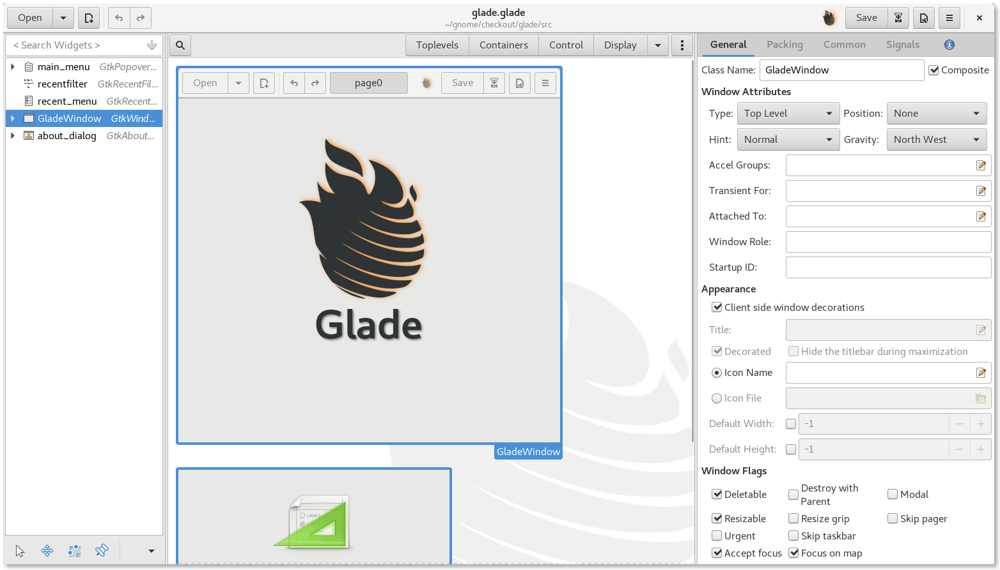

GTK+（GIMP Toolkit)是一套源码以LGPL许可协议分发、跨平台的图形工具包。最初是为GIMP写的，已成为一个功能强大、设计灵活的一个通用图形库，是GNU/Linux下开发图形界面的应用程序的主流开发工具之一。并且，GTK+也有Windows版本和Mac OS X版。

GTK+ 是一种图形用户界面（GUI）工具包。也就是说，它是一个库（或者，实际上是若干个密切相关的库的集合），它支持创建基于 GUI 的应用程序。可以把 GTK+ 想像成一个工具包，从这个工具包中可以找到用来创建 GUI 的许多已经准备好的构造块。差不多已经 10 年过去了。今天，在 GTK+ 的最新稳定版本 —— 2.8 版上（3.0测试中），仍然在进行许多活动，同时，GIMP 无疑仍然是使用 GTK+ 的最著名的程序之一，不过它已经不是惟一的使用 GTK+ 的程序了。已经为 GTK+ 编写了成百上千的应用程序，而且至少有两个主要的桌面环境（Xfce 和 GNOME）用 GTK+ 为用户提供完整的工作环境。

GTK+虽然是用C语言写的，但是您可以使用你熟悉的语言来使用GTK+，因为GTK+已经被绑定到几乎所有流行的语言上，如：C++,PHP, Guile,Perl, Python, TOM, Ada95, Objective C, Free Pascal, and Eiffel。

项目地址：https://www.gtk.org/

