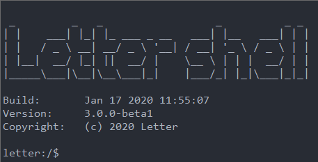

## 一个小而美的嵌入式shell - letter shell

[Letter_shell源码地址](https://github.com/NevermindZZT/letter-shell)

熟悉Linux的朋友的都知道，shell包裹在内核之外的人机交互界面，用于用户和内核之间打交道的功能，类似于windows CMD。 通过Shell将输入的命令与内核通讯，好让内核可以控制硬件开正确无误的操作工作。Shell有着不同的分类，比如Bourne shell（sh），Korn shell（ksh）、C shell （csh）、Bourne-again shell（bash）、tcsh。其中最常用的有csh和bash。Shell本身是一个用C语言编写的程序，它是用户使用Unix/Linux的桥梁，用户的大部分工作都是通过Shell完成的。

然而在嵌入式中，由于资源有限，自然很少使用shell，但随着MCU的资源越来越丰富，一些适用于嵌入式的shell工具也就问世了，本问将要介绍的是**LetterShell**，Letter shell是一个体积极小的嵌入式shell，当前最新版本是3.X。

Letter shell有如下功能：

- 命令自动补全，使用TAB键补全命令
- 命令帮助，使用help [command]显示命令帮助
- 帮助补全，输入命令后双击TAB键补全命令帮助指令
- 快捷键，支持使用CTRL+A~Z组合按键直接调用函数
- shell变量，支持在shell中查看和修改变量值，支持变量作为命令参数
- 登录密码，支持在shell中使用登录密码，支持超时自动锁定

移植与使用教程：[链接地址一](https://blog.bruceou.cn/2022/06/a-small-and-beautiful-embedded-shell-letter-shell/1714/)  , [链接地址二](https://blog.csdn.net/bruceoxl/article/details/125241554)
