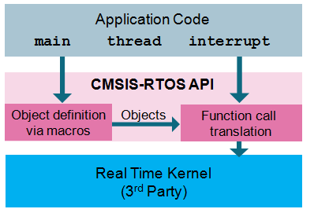
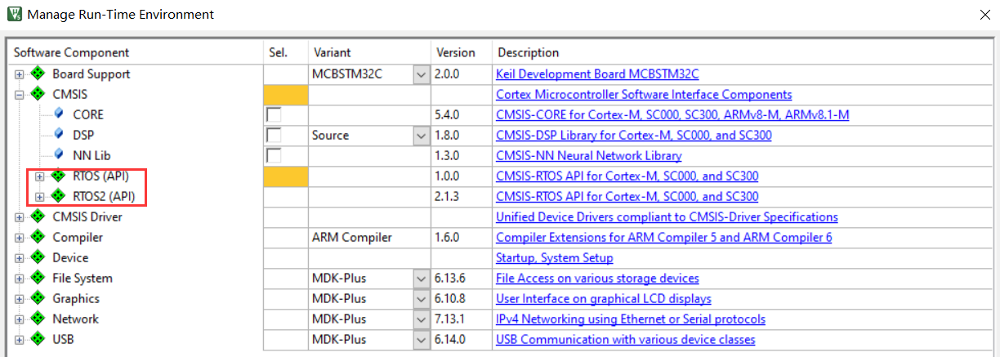

# 最好用的嵌入式系统-- CMSIS RTOS

CMSIS RTOS是ARM官方推出的RTOS API，很多人认为它就是RTX，实际上它只是封装了RTX。目前有两个版本。CMSIS-RTOS2兼容CMSIS-RTOS v1，具体内容请移步CMSIS RTOS官网。

它有哪些优势呢？下面是我开始研究它的原因：

l **集成在keil中，没有所谓移植概念**。针对任何MCU都可以一键添加，非常方便（如果你使用的编译器是keil，你只需在你的裸机工程中选择RTOS API即可）；

 

- **占用资源极小**。大约5kB，而且针对cortex系列ARM官方优化，效率不言自明；

- **组件丰富**。常用中间件USB/network/GUI/文件系统等，ARM官方已经准备好，只需要在keil中一键添加，同样没有移植概念；

- **仿真非常方便**。在keil的debug模式中，轻松查看任务的CPU、内存占用，还有各任务的运行时间、运行状态，各任务之间如何抢占，非常直观，不需要像其他RTOS那样调用专用的查看函数；

- **物联网核心。**CMSIS RTOS是ARM现在热推的物联网操作系统mbedOS的基础，搞懂这个RTOS API，mbedOS更容易上手，物联网是大势所趋，ARM的在这个浪潮中的地位众所周知（软银收购ARM的核心原因），物联网以后估计会产生大量的相关工作机会；

- **使用极简单**。再次提醒，CMSIS RTOS只是一套API，有兴趣的可以去研究它封装OS源码，没兴趣的，看看API拿来就用；

- **免费！**这点和freeRTOS一样，比uc/oS更有潜力，不过freeRTOS是个人开源项目，后续升级维护缺乏商业模式，而ARM刚从软银那里搞来大笔钱，估计后续发展推广更为强劲，话说回来，如果freeRTOS真的非常优秀，ARM也可以对它进行封装。

 

[CMSIS-RTOS示例](https://os.mbed.com/handbook/CMSIS-RTOS)

[CMSIS-RTOS 手册](https://arm-software.github.io/CMSIS_5/RTOS/html/index.html)

 