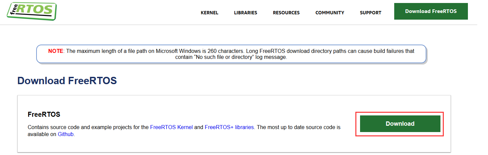
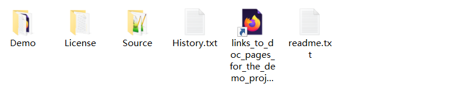
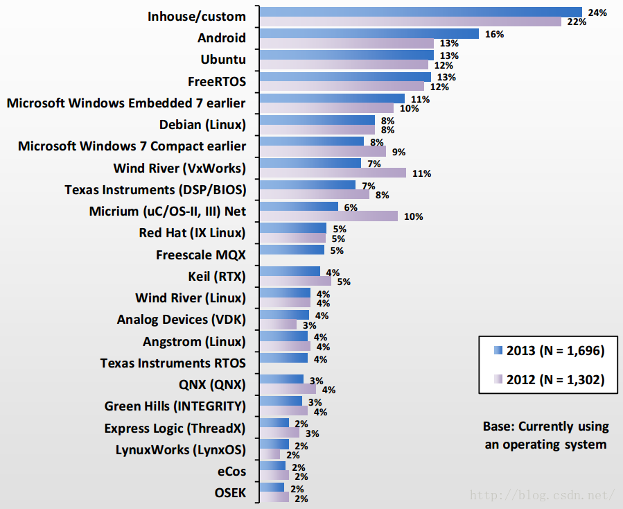

# 使用率最高的嵌入式系统 -- FreeRTOS

[FreeRTOS官方网站](www.freertos.org)

## 1.1 FreeRTOS介绍

**FreeRTOS**是一个可裁剪、可剥夺型的多任务内核，而且没有任务数限制。FreeRTOS提供了实时操作系统所需的所有功能，包括资源管理、同步、任务通信等。

FreeRTOS是用C和汇编来写的，其中绝大部分都是用C语言编写的，只有极少数的与处理器密切相关的部分代码才是用汇编写的，FreeRTOS结构简洁，可读性很强！最主要的是非常适合初次接触嵌入式实时操作系统学生、嵌入式系统开发人员和爱好者学习。

## 1.2 为什么选用FreeRTOS？

对比了许多RTOS，最终选择FreeRTOS，原因是多方面的：

- 大量开发者使用，并保持高速增长趋势。2011、2012、2013、2014、2015、2017年（暂时没有2016年的数据）的EEtimes杂志嵌入式系统市场报告显示，FreeRTOS在RTOS内核使用榜和RTOS内核计划使用榜上都名列前茅。更多的人使用可以促进发现BUG，增强稳定性。

- 简单。内核只有3个.c文件，全部围绕着任务调度，没有任何其它干扰，便于理解学习。而且，我根本不需要其它繁多的功能，只要任务调度就够了。

- 文档齐全。在FreeRTOS官方网站上，可以找到所有你需要的资料。

- 免费、开放源码。完全可以免费用于商业产品，开放源码更便于学习操作系统原理、从全局掌握FreeRTOS运行机理、以及对操作系统进行深度裁剪以适应自己的硬件。

- 2017年底，FreeRTOS作者加入亚马逊，担任首席工程师，FreeRTOS也由亚马逊管理。同时修改了用户许可证，FreeRTOS变得更加开放和自由。背靠亚马逊，相信未来FreeRTOS会更加稳定可靠。此外，以前价格不菲的《实时内核指南》和《参考手册》也免费开放下载，这使得学习更加容易。

## 1.3 初识FreeRTOS

FreeRTOS可以被移植到很多不同架构的处理器和编译器。每一个RTOS移植都附带一个已经配置好的演示例程，可以方便快速启动开发。更好的是，每个演示例程都附带一个说明网页，提供如何定位RTOS演示工程源代码、如何编译演示例程、如何配置硬件平台的全部信息。

演示例程说明网页还提供基本的RTOS移植细节信息，包括如何编写FreeRTOS兼容的中断服务例程，不同架构的中断处理会稍有不同。

### 1.3.1 FreeRTOS 资料获取

FreeRTOS 的源码和相应的官方书籍均可从官网 www.freertos.org 获得。


到FreeRTOS官方网站下载源码，下载包包含RTOS内核源码和官方移植演示工程。解压缩后放到合适的目录下。



每一个RTOS移植包都附带有预先配置好的演示例程 ，已经创建好了所有必须的RTOS源文件并包含了必须的RTOS头文件。推荐在提供的演示例程的基础上进行自己的FreeRTOS应用编程。

另外在Github上有FreeRTOS全部版本的代码。

[FreeRTOS Github](https://github.com/freertos/freertos)

### 1.3.2 FreeRTOS源码目录结构

FreeRTOS下载包中包含每个处理器移植和演示例程的源码。将所有移植包放入一个下载文件中大大简化了分类处理，但是下载包中的文件数量也多的惊人！无论如何，目录结构还是非常简单的，并且FreeRTOS实时内核仅仅只有3个文件（如果需要，还有一些附加文件，比如软件定时器、事件组以及协程）。

下载包目录包含两个子目录：FreeRTOS和FreeRTOS-Plus。如下所示：

```
FreeRTOS-Plus 包含FreeRTOS+组件和演示例程；
FreeRTOS 包含FreeRTOS实时内核源文件和演示例程。
```


FreeRTOS-Plus目录树包含多个自述文件（Readme）。接下来本文只描述FreeRTOS内核的核心源文件和演示例程，它们又被分成两个主要的子目录，如下所示：

```
FreeRTOS
|+-- Demo 包含演示例程工程；
|+-- Source 包含实时内核源文件。
```



RTOS代码的核心包含在三个文件中：tasks.c、queue.c、list.c。这三个文件位于FreeRTOS/Source目录。在该目录下还包含三个可选的文件：timers.c、event_groups.c、croutine.c，分别实现软件定时、事件组和协程功能。

FreeRTOS/Source目录结构如下所示：

```
FreeRTOS
| +-- Source FreeRTOS内核代码文件
| |+-- include FreeRTOS内核代码头文件
| |+-- Portable 处理器特定代码
| | |+--Compiler x 支持编译器x的所有移植包
| | |+--Compiler y 支持编译器y的所有移植包
| | |+--MemMang 内存堆实现范例
```


每个支持的处理器架构需要一小段与处理器架构相关的RTOS代码。这个是RTOS移植层，它位于FreeRTOS/Source/Portable/[相应编译器]/[相应CPU架构]子目录。

对于FreeRTOS，堆栈设计也属于移植层。FreeRTOS/Source/portable/MemMang目录下heap_x.c文件给出了多种堆栈方案，后续文章将会详细介绍堆栈操作。

FreeRTOS下载包中还包含各种处理器架构和编译器的演示例程。大多数的演示例程代码对所有移植都是通用的，位于FreeRTOS/Demo/Common/Minimal目录。FreeRTOS/Demo/Common/Full目录下的是历史遗留代码，仅用于PC。

FreeRTOS/Demo目录结构如下所示：

```
FreeRTOS
|+-- Demo
| |+-- Common 所有例程都可以使用的演示例程文件
| |+-- Dir x 用于x平台的演示例程工程文件
| |+-- Dir y 用于y平台的演示例程工程文件
```


FreeRTOS/Demo目录下剩余的子目录包含预先配置好的工程，可以用于构建个人演示例程。子目录的命名与移植平台和编译器相关。每一个RTOS移植包都有自己的说明文档。

演示例程目录举例：

如果以英飞凌TriBoard开发板硬件构建TriCoreGCC演示例程：TriCore演示例程工程文件位于FreeRTOS/Demo/TriCore_TC1782_TriBoard_GCC目录。目录FreeRTOS/Demo下的所有子目录（Common目录除外）都可以忽略或删掉。

如果以RX62N硬件构建Renesas RX600 IAR演示例程：IAR工程文件位于FreeRTOS/Demo/RX600_RX62N-RDK_IAR目录。目录FreeRTOS/Demo下的所有子目录（Common目录除外）都可以忽略或删掉。

## 附录1: EEtimes杂志嵌入式市场调查报告有关RTOS使用榜截图

附录1.1 2010和2011年RTOS使用榜


附录1.2 2012和2013年RTOS使用榜



附录1.3 2013年和2014年RTOS使用榜


附录1.4 2014年和2015年RTOS使用榜


附录1.5 2017年RTOS使用榜


附录1.6 2019年RTOS使用榜


