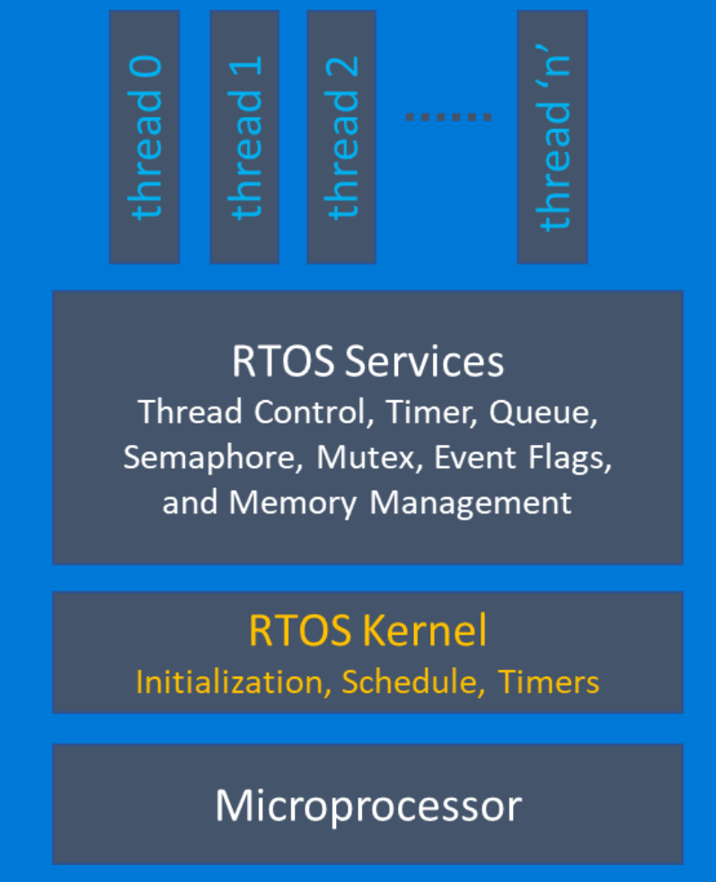
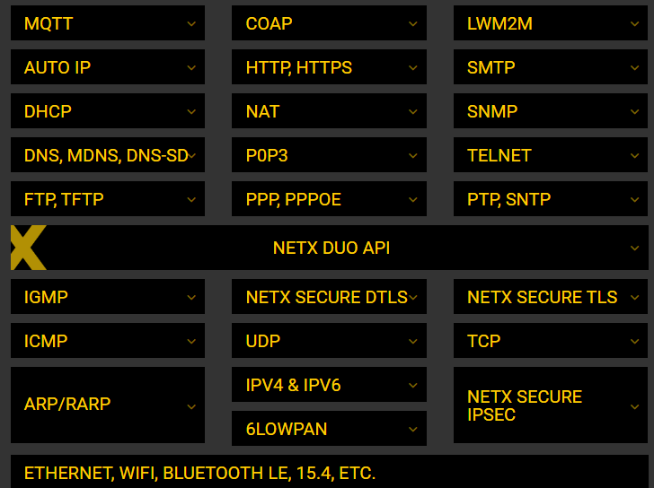
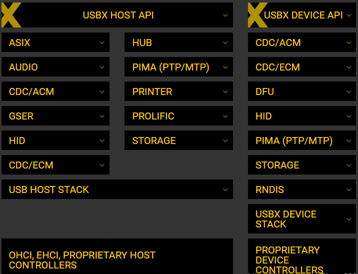
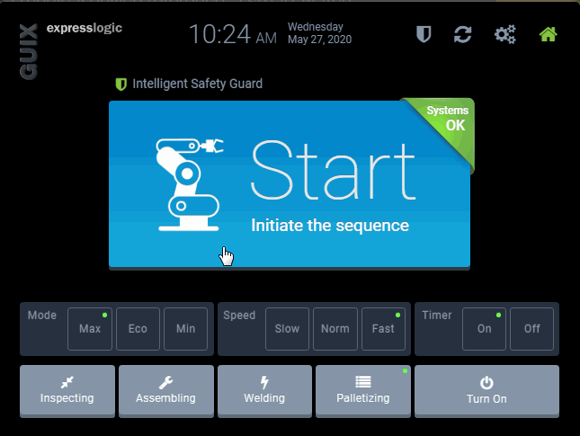
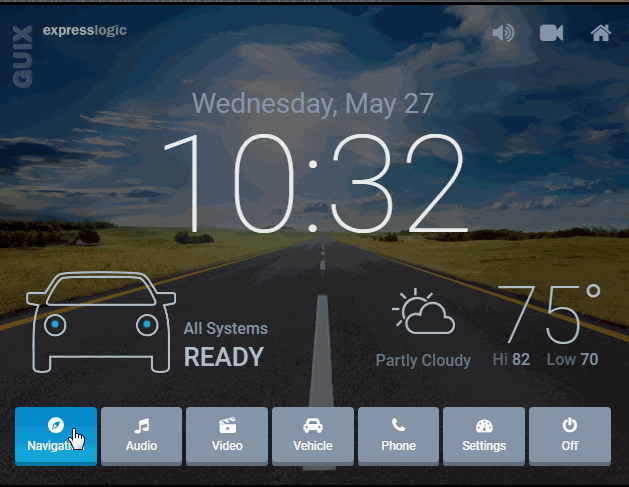
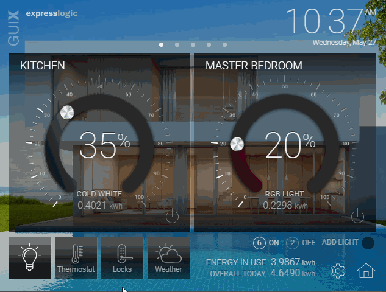

# 最安全的嵌入式系统 -- Azure-rtos(ThreadX)

微软在2019年对Express Logic的收购将其ThreadX实时操作系统带入了Azure折中。 现在被称为Azure RTOS ，它是一种工业级实时操作系统，适用于介于Arduino和Raspberry Pi之间的设备，需要的不仅是固件，而且还不需要完整的类似Azure Sphere的Linux。 该操作系统增加了Microsoft的边缘计算功能，该功能已经在超过20亿个设备上运行。

Azure RTOS ThreadX是专为嵌入式应用程序设计的高性能实时内核。 与其他实时内核不同，ThreadX具有通用性-通过使用功能强大的CISC，RISC和DSP处理器的应用程序，可以轻松地在基于微控制器的小型应用程序中扩展。

ThreadX可基于其基础体系结构进行扩展。因为ThreadX服务是作为C库实现的，所以只有应用程序实际使用的那些服务才被带到运行时映像中。 因此，ThreadX的实际大小完全由应用程序确定。 对于大多数应用程序，ThreadX的指令映像大小在2 KB至15 KB之间。

ThreadX是一个经过了多重安全认证的RTOS，最近微软把ThreadX的源码开源了，可谓广大嵌入式开发者的福音。

[GitHub地址](https://github.com/azure-rtos)

Azure RTOS ThreadX相比于其他嵌入式系统，有以下优势：

- **安全认证等级高**

ThreadX及其所有中间件的安全认证等级，至今没有一款小型RTOS可以与其匹敌。

（1）医疗 - FDA510（k），IEC-62304 Class C，IEC-60601，ISO-14971

（2）工业 - UL-1998，IEC-61508 SIL 4

（3）运输/铁路 - EN50128 SIL 4，BS50128, 49CFR236，IEC-61508

（4）航空航天设备 - DO-178B，ED-12B，DO-278

（5）汽车 - IEC-61508 ASIL D

（6）核应用 - IEC-61508

（7）家电 - UL/IEC 60730/60335

- **协议栈丰富**

ThreadX的网络协议栈对其它网络协议栈几乎是碾压性优势，无对手。 

- **USB协议栈功能齐全**

USB协议栈也不错，日常用的功能也齐全。

- **GUI堪称完美**

现在很多RTOS全家桶基本都放弃了GUI的研究，主要是维护比较耗精力，需要根据用户的需求不断改进。像RTX全家桶就改用SEGGER的emWin，绿山（Green Hills）推荐用的就是Altia GUI。而ThreadX则不同，有自己完备的GUI，而且性能还略强。ThreadX GUIX的汽车，医疗，工业，消费电子等界面效果展示

工业控制：

医疗：

 

汽车；

  

智能家居：

消费电子：

好了，对于Azure RTOS ThreadX的介绍就到这里了，有兴趣的赶紧去试试吧，特别是大家所熟知的STM32，移植起来非常方便，笔者在我的博客和网站中也会详细介绍Azure RTOS ThreadX的移植过程。另外很多IDE对于Azure RTOS ThreadX都有很好的支持，比如KEIL、IAR、Embedded Studio。

 

