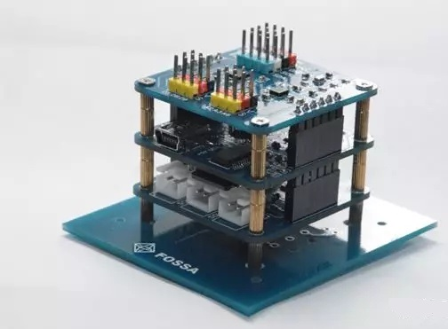

FOSSASAT-1 是一个小型的开源卫星系统，你没有看出，就是卫星，FOSSASAT-1开发和发射成本你不足30000欧元，这是西班牙的第一颗微型卫星，也是世界上有史以来发射到太空的最小卫星之一，主控芯片使ATmel的抗辐射芯片ATmega328P-AU。FOSSASAT-1尺寸仅为5x5x5cm，重量约为250g。

项目地址：https://github.com/FOSSASystems/FOSSASAT-1