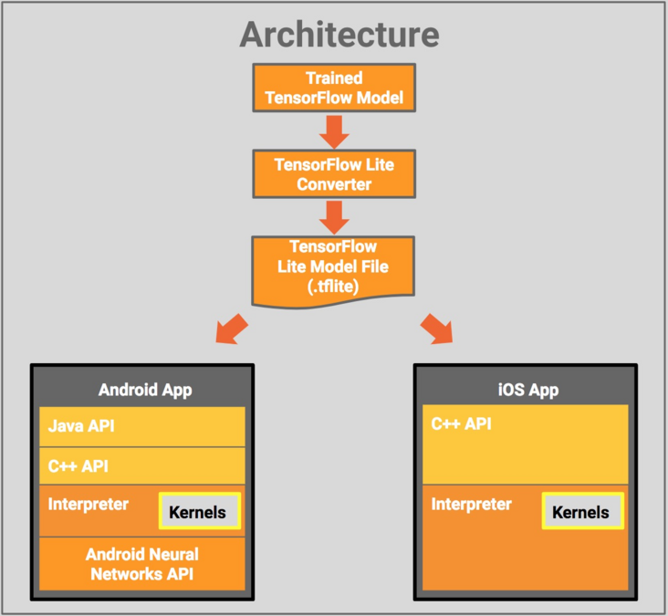

TensorFlow Lite是专门针对移动和嵌入式设备的特性重新实现的TensorFlow版本。相比普通的TensorFlow，它的功能更加精简，不支持模型的训练，不支持分布式运行，也没有太多跨平台逻辑，支持的op也比较有限。但正因其精简性，因此比较适合用来探究一个机器学习框架的实现原理。不过准确讲，从TensorFlow Lite只能看到预测（inference）部分，无法看到训练（training）部分。

Tensorflow Lite模型的数据格式与Tensorflow桌面端不同，需要使用Tensorflow Lite转换为.tflite格式，然后应用到移动端。

[项目地址](https://github.com/tensorflow/tensorflow/tree/master/tensorflow/lite/)

[开发手册](https://tensorflow.google.cn/lite/guide)

